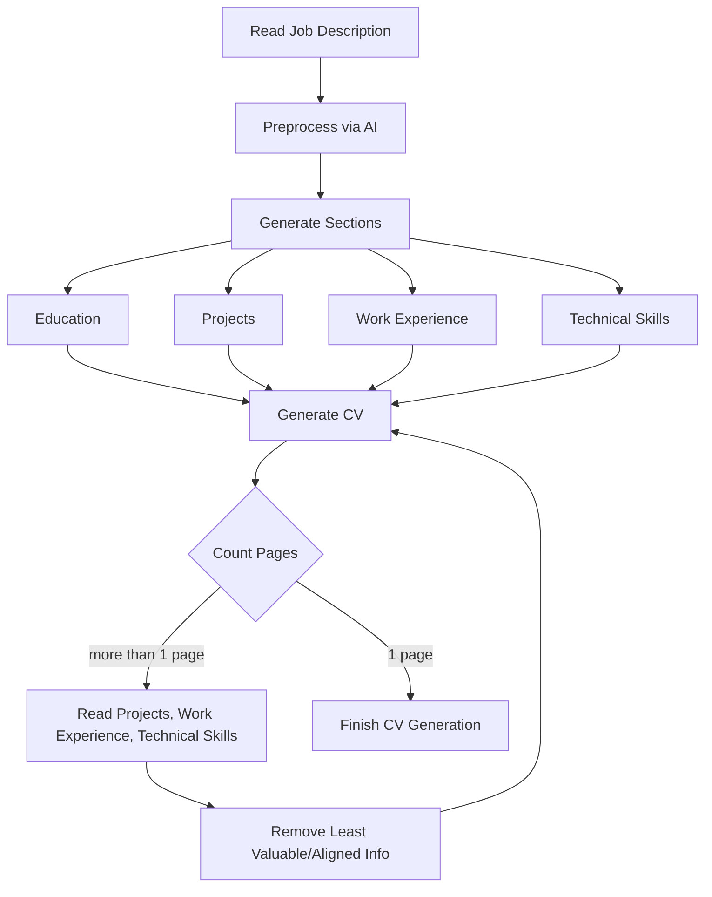

# The Forge


The Forge is an intelligent CV generator that creates tailored, professional resumes based on job descriptions and personal information. It leverages AI to optimize content and ensure your CV stands out.

## Features

- Generates custom CVs based on job descriptions
- AI-powered content optimization
- Automatic CV reduction to fit page limits [Under development]
- LaTeX-based output for professional formatting

### Todo

- Flask Frontend
- Containerised
- Deployed on server

## Workflow


## OpenAI Swarm Implementation

The Forge utilizes OpenAI's Swarm framework to create a multi-agent system for intelligent CV generation. This approach allows for a more modular, efficient, and specialized process in creating tailored CVs.

### Purpose

The Swarm implementation in The Forge serves several key purposes:

1. **Modular CV Generation**: By breaking down the CV creation process into specialized tasks handled by different agents, we can achieve a more focused and efficient workflow.

2. **Dynamic Adaptation**: The multi-agent system can adapt to different requirements and job descriptions more effectively, ensuring that each CV is uniquely tailored to the specific position.

3. **Improved Quality Control**: With dedicated agents for optimization and review, we can ensure that the final CV meets high standards of quality and relevance.

4. **Scalability**: The Swarm architecture allows for easy addition of new agents or modification of existing ones, making the system highly scalable and adaptable to future requirements.

### Functionality

The Swarm implementation in The Forge consists of the following key components:

1. **Section Generator Agent**: Responsible for creating the initial content for each CV section based on the user's information and the job description.

2. **Optimizer Agent**: Refines and condenses the CV content to ensure it's impactful and fits within the specified page limit.

3. **Reviewer Agent**: Provides a final review of the CV, offering suggestions for improvements and ensuring overall quality.

4. **Formatter Agent**: Ensures proper LaTeX formatting and visual appeal of the CV.

These agents work together in a coordinated manner, passing control and context between each other as needed. This allows for a comprehensive and intelligent CV generation process that leverages the strengths of each specialized agent.

## Setup

1. Clone the repository:
   ```
   git clone https://github.com/yourusername/theforge.git
   cd theforge
   ```

2. Create a virtual environment and activate it:
   ```
   python -m virtualenv .venv
   source .venv/bin/activate  # On Windows, use `.venv\Scripts\activate`
   ```

3. Install the required packages:
   ```
   pip install -r requirements.txt
   ```

4. Create a `.env` file in the project root and add your OpenAI API key:
   ```
   OPENAI_API_KEY=your_api_key_here
   ```
   Make sure to use a valid OpenAI API key.

5. Create an `info.yml` file based on the structure in `info.example.yml`:
   ```
   cp info.example.yml info.yml
   ```
   Then, edit `info.yml` with your personal details and CV information.

## Usage

1. Prepare your job description:
   - Edit the `job_description.txt` file with the details of the job you're applying for.
   - You can use the provided example as a template.

2. Run the main script to generate your CV:
   ```
   python main.py
   ```

Your generated CV will be available in the `CVs` directory.
