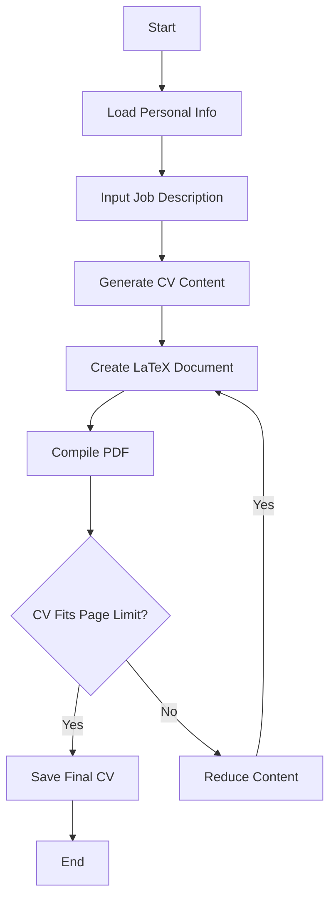

# The Forge


The Forge is an intelligent CV generator that creates tailored, professional resumes based on job descriptions and personal information. It leverages AI to optimize content and ensure your CV stands out.

## Features

- Generates custom CVs based on job descriptions
- AI-powered content optimization
- Automatic CV reduction to fit page limits [Under development]
- LaTeX-based output for professional formatting

### Todo

- Flask Frontend
- Containerised
- Deployed on server

## Workflow



## Setup

1. Clone the repository:
   ```
   git clone https://github.com/yourusername/theforge.git
   cd theforge
   ```

2. Create a virtual environment and activate it:
   ```
   python -m virtualenv .venv
   source .venv/bin/activate  # On Windows, use `.venv\Scripts\activate`
   ```

3. Install the required packages:
   ```
   pip install -r requirements.txt
   ```

4. Create a `.env` file in the project root and add your OpenAI API key:
   ```
   OPENAI_API_KEY=your_api_key_here
   ```
   Make sure to use a valid OpenAI API key.

5. Create an `info.yml` file based on the structure in `info.example.yml`:
   ```
   cp info.example.yml info.yml
   ```
   Then, edit `info.yml` with your personal details and CV information.

## Usage

1. Prepare your job description:
   - Edit the `job_description.txt` file with the details of the job you're applying for.
   - You can use the provided example as a template.

2. Run the main script to generate your CV:
   ```
   python main.py
   ```

Your generated CV will be available in the `CVs` directory.
